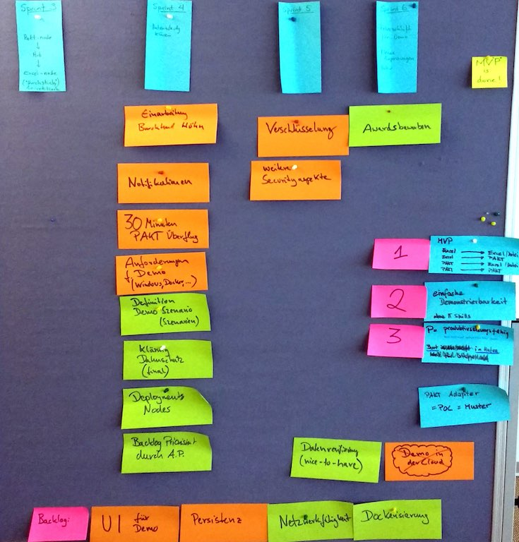

---?image=https://www.prevo.ch/images/prevo/prevo-logo.svg&size=contain

### Review #03
# Open

---

### topics today

#### sprint goal 

Participate with Excel-File and get matches from PAKT

#### side topics

#### What's next?

---

### Excel <- Hub -> PAKT

+++

### details

---

### side topics

[legal background](https://open-prevo.github.io/openprevo/#_legal_compliance) added to arc42: FZL and BVG

externalize hub and node configuration

[unified naming](https://github.com/open-prevo/openprevo/issues/41) in code and docu

---

### What's next?

#### 3 sprints over <-> 3 sprints left

#### new PO for the last 2 sprints due to vacation

#### first sprint refinement

+++

---

### Thanks! - Q&A?
